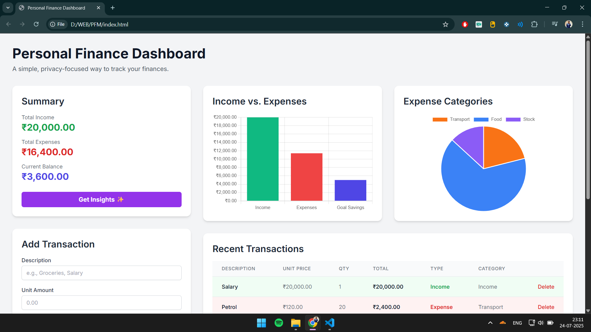

# Personal Finance Dashboard ✨

A simple, privacy-focused dashboard to manually track your monthly income, expenses, and savings goals. This project was conceptualized and built in under 1 hours with the help of Google's Gemini.



---

## 🚀 Project Overview

This Personal Finance Dashboard is a lightweight, single-page web application designed for users who prefer manual control over their financial data. Unlike complex financial apps that require linking bank accounts, this tool prioritizes simplicity and privacy by storing all data directly in the user's browser (`localStorage`). It provides a clean interface to monitor your financial health, track spending, and work towards your savings goals, with an added AI-powered feature for personalized financial advice.

## ⭐ Key Features

* **Manual Transaction Entry:** Add income, expenses, and contributions to savings goals with descriptions, amounts, and optional quantities.
* **Expense Categorization:** Assign expenses to predefined categories (Food, Transport, etc.) or specify a custom category.
* **Savings Goals:** Create and manage multiple savings goals with visual progress bars.
* **Interactive Charts:**
    * **Income vs. Expenses:** A bar chart to visualize your cash flow.
    * **Expense Categories:** A pie chart to see where your money is going.
* **Transaction History:** A clear, color-coded table of all your recent transactions.
* **AI-Powered Insights (Powered by Gemini):** Get personalized financial tips and an analysis of your spending habits by clicking the "Get Insights" button.
* **Privacy-Focused:** All your financial data is stored locally in your browser and is never sent to a server.
* **Fully Responsive:** A clean and modern UI that works seamlessly on both desktop and mobile devices.

## 🛠️ Tech Stack

* **Frontend:** HTML5, CSS3
* **Styling:** [Tailwind CSS](https://tailwindcss.com/)
* **Charting:** [Chart.js](https://www.chartjs.org/)
* **AI Integration:** [Google Gemini API](https://ai.google.dev/)

## ⏱️ Development Time

This entire project, from concept to a fully functional application with AI features, was completed in **under 2 hours**.

## ⚙️ Setup and Installation

To run this project on your local machine, follow these simple steps:

1.  **Download the Code:**
    * Clone the repository or download the `index.html` file.

2.  **Get a Gemini API Key:**
    * The "Get Insights" feature requires a Google Gemini API key.
    * Visit [Google AI Studio](https://aistudio.google.com/) to get your free API key.
    * Click on **"Get API key"** and create a new key.

3.  **Add the API Key to the Code:**
    * Open the `index.html` file in a text editor.
    * Find the following line in the `<script>` section (around line 600):
        ```javascript
        const apiKey = ""; // API key is handled by the environment
        ```
    * Paste your API key inside the quotes:
        ```javascript
        const apiKey = "YOUR_PERSONAL_API_KEY_GOES_HERE";
        ```

4.  **Run the Application:**
    * Save the `index.html` file.
    * Open it directly in your web browser (e.g., Chrome, Firefox, Edge).

That's it! The dashboard is now ready to use.

## 📖 How to Use

1.  **Add Transactions:** Use the form on the left to add your income and expenses.
2.  **Set Goals:** Click the "Add New Goal" button to create savings goals.
3.  **Update Goals:**
    * Use the "Update" button on a goal to set the new total amount saved.
    * Alternatively, select the "Goal" transaction type to add a contribution directly from the main form.
4.  **Get Insights:** After adding a few transactions, click the "Get Insights ✨" button in the Summary card for AI-powered financial advice.

## 🔮 Future Improvements

* Allow users to add or edit expense categories.
* Implement data export/import functionality (e.g., to CSV).
* Add more detailed charts, such as spending over time.
* Integrate a date picker for transactions.

---

This project is open-source. Feel free to fork, modify, and use it as you see fit!
